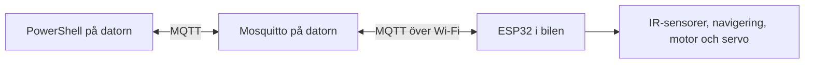

# Från bygge och flashning till Wi-Fi och MQTT

Den här guiden visar hur du använder MQTT-implementationen i SCRUM-50 tillsammans med navigeringen från SCRUM-16. Den gäller **Arduino Nano ESP32 med ESP32-S3**, ESP-IDF och en Windows-dator som kör Mosquitto.

Du går igenom första installationen, bygger och flashar firmware, ansluter bilen till nätverket och använder datorn för att läsa sensordata, ändra inställningar samt starta och stoppa bilen.

**Verifieringsläge:** användarens loggar från den 8 september 2026 visar fungerande Wi-Fi/MQTT för grundversionen. Efter flashning av `DriverStyle`-tillägget visar loggen upprepade `stack overflow in task main` efter att Wi-Fi fått IP-adress. Korrigeringen höjer main-stack från 3584 till 8192 byte och visar `main_stack_min` i seriell logg. Den måste byggas, flashas och verifieras på bilen. Hosttester och isolerade MQTT-tester passerar; dessa kan inte verifiera ESP32:s stackmarginal. ESP-IDF:s Python blockeras av Windows i agentmiljön.

## Innehåll

1. [Så hänger delarna ihop](#1-så-hänger-delarna-ihop)
2. [Förbered datorn och terminalerna](#2-förbered-datorn-och-terminalerna)
3. [Förbered Wi-Fi och Mosquitto](#3-förbered-wi-fi-och-mosquitto)
4. [Ställ in firmware](#4-ställ-in-firmware)
5. [Bygg firmware](#5-bygg-firmware)
6. [Flasha och läs seriell logg](#6-flasha-och-läs-seriell-logg)
7. [Anslut datorns MQTT-verktyg och ta emot data](#7-anslut-datorns-mqtt-verktyg-och-ta-emot-data)
8. [Skicka inställningar och kontrollera svaret](#8-skicka-inställningar-och-kontrollera-svaret)
9. [Starta och stoppa bilen](#9-starta-och-stoppa-bilen)
10. [Förstå MQTT-meddelandena och skicka själv](#10-förstå-mqtt-meddelandena-och-skicka-själv)
11. [Hitta parametrarna i koden](#11-hitta-parametrarna-i-koden)
12. [Vad behöver göras om när något ändras?](#12-vad-behöver-göras-om-när-något-ändras)
13. [Felsökning](#13-felsökning)
14. [Kort rutin inför nästa körning](#14-kort-rutin-inför-nästa-körning)

## 1. Så hänger delarna ihop

Det finns tre delar:

| Del | Uppgift |
| --- | --- |
| **ESP32 i bilen** | Läser IR-sensorerna, väljer väg, styr motor och servo samt skickar telemetri. |
| **Mosquitto på datorn** | Är MQTT-brokern. Den tar emot meddelanden och skickar dem vidare till dem som prenumererar på rätt topic. |
| **PowerShell-skripten på datorn** | Skickar inställningar, start, stopp och heartbeat. Andra skript visar eller sparar bilens svar. |



**Wi-Fi ger nätverksanslutningen. MQTT är kommunikationen ovanpå nätverket.** Bilen kan därför ha kontakt med Wi-Fi utan att ha kontakt med brokern, exempelvis om MQTT-lösenordet är fel.

Ett **topic** är namnet på en meddelandekanal, till exempel `cnb/vagrant/telemetry`. Att **publicera** betyder att skicka ett meddelande. Att **prenumerera** betyder att be brokern leverera meddelanden från ett topic.

USB används för flashning och seriell felsökning. Efter flashningen kan normal MQTT-drift fungera utan USB, förutsatt att bilen har sin avsedda strömförsörjning och når nätverket.

## 2. Förbered datorn och terminalerna

Du behöver projektets arbetskopia med MQTT-ändringarna, en USB-kabel som kan överföra data, ESP-IDF 6.0-miljön och Mosquitto med klientverktygen `mosquitto_pub`, `mosquitto_sub` och `mosquitto_passwd`.

Om ESP-IDF saknas, följ [Espressifs Windows-installation för ESP-IDF 6.0](https://docs.espressif.com/projects/esp-idf/en/v6.0/esp32s3/get-started/windows-setup.html). Välj version 6.0 för att följa den miljö som denna implementation kontrollerats mot. Windows-installation av Mosquitto finns på [Mosquittos nedladdningssida](https://mosquitto.org/download/).

Använd följande terminaler. Öppna fler när du når respektive steg:

| Terminal | Används till | Ska vara öppen under körning? |
| --- | --- | --- |
| A: ESP-IDF PowerShell | `menuconfig`, bygge, flashning och seriell monitor | Bara vid utveckling eller seriell övervakning. |
| B: PowerShell | Mosquitto-brokern | Ja, när du startar brokern manuellt här. |
| C: PowerShell | Visa inkommande MQTT-data | Ja, om du vill följa körningen. |
| D: PowerShell | `run-car.ps1` och heartbeat | Ja, så länge bilen ska vara tillåten att köra. |
| E: PowerShell | Ändra inställningar eller skicka stopp | Vid behov. |

**Projektroten** betyder mappen som innehåller `README.md`, `firmware`, `tools` och `documentation`. Byggkommandon körs i `firmware`. Operatörskommandon körs i projektroten.

I varje ny terminal där du ska arbeta med projektet, gå först till projektroten. Ersätt exempelsökvägen med den faktiska mappen där MQTT-arbetskopian ligger:

```powershell
Set-Location 'C:\projekt\elektronik_projektet-SCRUM-50'
```

Förväntat: terminalen står i mappen som innehåller `firmware` och `tools`.

Under första provet ska bilen stå så att drivhjulen kan rotera fritt och du kan bryta strömmen. Ett MQTT-stopp ersätter inte en fysisk möjlighet att stänga av bilen.

## 3. Förbered Wi-Fi och Mosquitto

### 3.1 Välj nätverk och hitta datorns adress

Bilen ska ansluta till ett **2,4 GHz Wi-Fi-nätverk**. Datorn måste vara nåbar från det nätverket; den kan exempelvis vara ansluten till samma router via Wi-Fi eller kabel. Undvik gästnätverk med klientisolering, eftersom de kan hindra bilen från att nå datorn.

Ta fram nätverkets namn, **SSID**, och Wi-Fi-lösenordet. Kör sedan på datorn:

```powershell
ipconfig
```

Förväntat: du ser nätverksadaptrarnas adresser. Leta efter IPv4-adressen för anslutningen till bilens nätverk. Använd inte en VPN- eller virtuell adapters adress av misstag.

Använd `BROKER_HOST_OR_IP` som platshållare för datorns verkliga LAN-adress och port `1883`. Bilen ska använda `mqtt://BROKER_HOST_OR_IP:1883`. `localhost` på ESP32 betyder ESP32 själv, inte datorn.

### 3.2 Skapa brokerns privata konfiguration

Följande görs en gång från projektroten i terminal B. Om du redan har en fungerande broker med samma konton och ACL behöver du inte skapa den igen.

Skapa en mapp utanför Git-projektet:

```powershell
New-Item -ItemType Directory -Path "$env:USERPROFILE\cnb-mqtt\data" -Force
```

Förväntat: mappen `cnb-mqtt` och undermappen `data` finns i din användarmapp. `data` används för brokerns sparade retained-meddelanden.

Kopiera konfigurationsmallen vid första installationen:

```powershell
Copy-Item .\tools\mqtt\mosquitto.conf.example "$env:USERPROFILE\cnb-mqtt\mosquitto.conf"
```

Förväntat: en privat konfigurationsfil har skapats. Kopiera inte över en redan anpassad fil.

Kopiera behörigheterna:

```powershell
Copy-Item .\tools\mqtt\mosquitto-acl.example "$env:USERPROFILE\cnb-mqtt\acl"
```

Förväntat: filen `acl` innehåller vilka topics bilen och datorn får läsa respektive skriva.

Öppna konfigurationen:

```powershell
notepad "$env:USERPROFILE\cnb-mqtt\mosquitto.conf"
```

Förväntat: filen öppnas. Ersätt **alla** `REPLACE_ME` med namnet på din Windows-användarmapp. Kontrollera att `password_file`, `acl_file` och `persistence_location` pekar på mappen du just skapade. Spara filen. Behåll `/` i sökvägarna som i mallen.

### 3.3 Skapa två MQTT-konton

Kontona har olika uppgifter:

| Konto | Ska användas av | Var lösenordet fylls i senare |
| --- | --- | --- |
| `cnb-vagrant` | ESP32 i bilen | ESP-IDF `menuconfig`. |
| `cnb-dashboard` | PowerShell-verktygen på datorn | `tools/mqtt/.env`. |

Detta är **MQTT-lösenord**, alltså andra uppgifter än Wi-Fi-lösenordet. Välj ett lösenord per konto och håll reda på vilket som hör till vilket.

Om Mosquitto är installerat på standardplatsen, skapa den första användaren:

```powershell
& "$env:ProgramFiles\mosquitto\mosquitto_passwd.exe" -c "$env:USERPROFILE\cnb-mqtt\passwords" cnb-vagrant
```

Förväntat: du får ange och bekräfta lösenordet för bilen. **`-c` skapar lösenordsfilen och ska bara användas när filen skapas första gången.** Använd inte `-c` när du lägger till nästa användare eller byter lösenord i en befintlig fil.

Lägg till datorns konto:

```powershell
& "$env:ProgramFiles\mosquitto\mosquitto_passwd.exe" "$env:USERPROFILE\cnb-mqtt\passwords" cnb-dashboard
```

Förväntat: datorns användare läggs till i samma fil utan att bilens användare tas bort.

### 3.4 Starta brokern

```powershell
& "$env:ProgramFiles\mosquitto\mosquitto.exe" -c "$env:USERPROFILE\cnb-mqtt\mosquitto.conf" -v
```

Förväntat: Mosquitto startar och lyssnar på port `1883`. Låt terminal B vara öppen. Om porten redan används kan en Mosquitto-tjänst eller annan broker redan vara igång; se felsökningen innan du startar ytterligare en.

Windows-brandväggen måste tillåta inkommande TCP-trafik till brokern på port `1883` från det privata nätverket. Använd en regel begränsad till **Privat profil och det lokala nätet**. Stäng inte av hela brandväggen. Den här installationen använder vanlig MQTT utan TLS och ska inte exponeras mot internet.

## 4. Ställ in firmware

Gör detta i **terminal A, ESP-IDF PowerShell**, från projektroten.

Kontrollera att rätt utvecklingsmiljö är aktiv:

```powershell
idf.py --version
```

Förväntat: ESP-IDF-versionen visas. Om `idf.py` inte hittas, eller Python-moduler saknas, öppna terminalen som hör till din ESP-IDF-installation.

Gå till firmwaremappen:

```powershell
Set-Location .\firmware
```

Förväntat: du står i projektets `firmware`-mapp.

Välj krets vid första konfigurationen av arbetskopian:

```powershell
idf.py set-target esp32s3
```

Förväntat: projektet konfigureras för ESP32-S3. Gör detta **före** dina egna inställningar i nästa steg. `set-target` återställer byggkonfigurationen; det är inte ett kommando som behöver köras inför varje vanligt bygge.

Öppna konfigurationsmenyn:

```powershell
idf.py menuconfig
```

Förväntat: ESP-IDF:s meny öppnas. Gå till **Autonomous car network configuration** och fyll i:

| Menyinställning | Vad du ska ange |
| --- | --- |
| `Enable WiFi` | Aktiverad. |
| `WiFi SSID` | Namnet på bilens 2,4 GHz-nätverk. |
| `WiFi password` | Lösenordet till det nätverket. |
| `Enable MQTT telemetry and runtime control` | Aktiverad. |
| `MQTT broker URI` | `mqtt://BROKER_HOST_OR_IP:1883`, med **datorns riktiga LAN-adress**. |
| `MQTT client ID` | `cnb-vagrant`. Identiteten ska vara unik för bilen. |
| `MQTT username` | `cnb-vagrant`. |
| `MQTT password` | MQTT-lösenordet du skapade för **cnb-vagrant**. |
| `MQTT keepalive in seconds` | Behåll `30` till att börja med. |

Spara och avsluta menyn. Menyns tangentförklaringar visar hur.

**Main-taskens stack:** projektets [sdkconfig.defaults](../../firmware/sdkconfig.defaults) anger `CONFIG_ESP_MAIN_TASK_STACK_SIZE=8192`. Vid uppgradering behåller en befintlig `sdkconfig` sina gamla värden. Om bygget säger att stacken är för liten: välj **Component config → ESP System Settings → Main task stack size** i `menuconfig`, ange **8192**, spara och bygg igen. Radera inte `sdkconfig`, eftersom den också innehåller dina anslutningsuppgifter. [Byggkontrollen](../../firmware/main/source/main.cpp) stoppar MQTT-byggen med mindre stack.

Inställningarna sparas lokalt i `firmware/sdkconfig`. Under bygget genereras `firmware/build/config/sdkconfig.h`, som koden läser. **Redigera normalt via `menuconfig`; ändra inte den genererade headern.** `sdkconfig` innehåller lösenord och är Git-ignorerad.

Att stänga av MQTT ger inte ett lokalt körläge i den här implementationen: bilen behöver MQTT-start och heartbeat för att få köra.

## 5. Bygg firmware

Kör i terminal A, fortfarande i `firmware`:

```powershell
idf.py build
```

Förväntat: koden kompileras och länkas utan fel. Första bygget kan behöva internet för att hämta ESP-MQTT och cJSON enligt `main/idf_component.yml`. Byggresultatet innehåller bland annat `build/elektronik_projektet.bin` samt bootloader och partitionstabell.

Kontrollera slutet av byggloggen: bygget ska vara klart och binären ska rymmas i app-partitionen. Den gamla uppgiften om 7 % ledigt utrymme gäller en tidigare version och ska inte användas som mått för den här versionen.

**Bygge ändrar filer på datorn. Flashning i nästa steg skriver firmware till ESP32.**

## 6. Flasha och läs seriell logg

### 6.1 Hitta porten

Anslut kortet via USB. Kontrollera Windows Enhetshanteraren, eller lista seriella portar:

```powershell
[System.IO.Ports.SerialPort]::GetPortNames()
```

Förväntat: en eller flera portar visas, till exempel `COM7`. Kontrollera vilken port som försvinner när du kopplar ur kortet. **`COM7` är bara ett exempel i resten av guiden.** Stäng andra program som använder samma port.

### 6.2 Flasha firmware

Kör i terminal A, i `firmware`, med rätt port:

```powershell
idf.py -p COM7 flash
```

Förväntat: verktyget identifierar ESP32-S3, skriver projektets firmware och avslutar utan fel. Arbetsgången följer [Espressifs guide för bygge och flashning](https://docs.espressif.com/projects/esp-idf/en/stable/esp32s3/get-started/start-project.html).

### 6.3 Öppna monitorn

```powershell
idf.py -p COM7 monitor
```

Förväntat: du ser startloggen och `CnB serial ready`, följt av återkommande sensorvärden. Loggen visar även planerad styrning, hastighetskommando och om bilen är armed. Vid behov trycker du kortets resetknapp för att se uppstarten igen. Avsluta ESP-IDF-monitorn med **Ctrl+]**.

Bilen ska starta **disarmed** och med avstängd motorbrygga. Seriell logg visar att programmet kör; MQTT-kontakten kontrolleras separat i nästa avsnitt.

Om automatisk flashning inte får kontakt kan Nano ESP32 sättas i nedladdningsläge genom att ansluta **B1 till GND** och trycka **RST**, därefter ta bort förbindelsen och kontrollera COM-porten igen. Använd kortets märkning och [Arduinos beskrivning av B1 och B0](https://support.arduino.cc/hc/en-us/articles/9625819325212-About-the-B1-and-B0-pins-on-the-Nano-ESP32). Nedladdningsläge är något annat än normal programkörning; efter lyckad flashning kan en reset behövas för att starta programmet.

## 7. Anslut datorns MQTT-verktyg och ta emot data

### 7.1 Skapa datorns inställningar

Öppna terminal C och gå till **projektroten**. Kopiera mallen första gången:

```powershell
Copy-Item .\tools\mqtt\.env.example .\tools\mqtt\.env
```

Förväntat: en lokal `.env` finns. Kopiera inte över den om du redan har fyllt i rätt uppgifter.

Öppna filen:

```powershell
notepad .\tools\mqtt\.env
```

Förväntat: filen öppnas. Fyll i datorns brokeradress och **datorns MQTT-konto**:

```dotenv
CNB_MQTT_HOST=BROKER_HOST_OR_IP
CNB_MQTT_PORT=1883
CNB_MQTT_USERNAME=cnb-dashboard
CNB_MQTT_PASSWORD=DITT_MQTT_LOSENORD_FOR_DATORN
```

Spara. Skriv värdena utan omgivande citattecken. `CNB_MQTT_HOST` är bara ett värdnamn eller en IP-adress, **utan** `mqtt://` och port. Porten har ett eget fält.

Eftersom skripten körs på brokerdatorn kan denna `.env` också använda `127.0.0.1`. Bilens broker-URI måste fortfarande använda datorns adress på nätverket.

`.env` är Git-ignorerad. Den läses när ett skript startar, så starta om skriptet efter att du ändrat filen.

### 7.2 Prenumerera på bilens meddelanden

```powershell
.\tools\mqtt\watch-telemetry.ps1
```

Förväntat: terminalen visar sensorer i kolumner och korta statusrader. När bilen är ansluten kommer telemetri normalt en gång per sekund. Status och senaste konfigurations-/kommandotillstånd kan visas direkt eftersom de är retained. Tabellen nedan beskriver JSON-fälten bakom vyn; använd `-Raw` om du vill se själva JSON-meddelandena.

Leta efter:

| Meddelande | Vad det betyder |
| --- | --- |
| `cnb/vagrant/status` med `"online":true` | Bilen har rapporterat att den är ansluten. Bekräfta med nya telemetrimeddelanden. |
| `config/state` med `"result":"defaults"` och revision `0` | Ingen giltig fjärrkonfiguration har tillämpats under denna uppstart. |
| `config/state` med `"result":"applied"` | En MQTT-konfiguration har tillämpats. Den kan komma från brokerns sparade värde. |
| `command/state` med `"control_state":"disarmed"` | Bilen har inte tillåtelse att köra. |
| Telemetri där `sequence` och `uptime_ms` ökar | Nya data kommer från en körande firmware. |

**Ett retained-meddelande kan vara gammalt.** Ett ensamt `online:true` eller `armed` bevisar inte att bilen är tillgänglig just nu. Använd nya telemetrimeddelanden och startskriptets kvittens för att bedöma aktuell kontakt.

### 7.2.1 Läsbar terminalvy och rå JSON

`watch-telemetry.ps1` visar nu varje telemetriprov i en kompakt tabell. Exempel med illustrativa ADC-värden:

```text
[12:30:05] #263 | DISARMED / STOPPED | uptime 264570 ms
  Mode: decide_action | Reason: operator_stop | Steering: 90.0 deg
  Sensor              LEFT     CENTER      RIGHT
  Distance cm        25.06      70.11     380.67
  ADC raw             1200        500        150
  Motor cmd: 0.00 | PWM forward: 0.00 | backward: 0.00 | Closest: left (25.06 cm)
```

Avstånd och duty visas med två decimaler, styrning med en decimal. PWM anges fortfarande som andel `0–1`, inte procent. Klockslaget är datorns lokala mottagningstid; `uptime` är bilens drifttid. Konfigurationssvar visas som `CONFIG`, kommandosvar som `COMMAND` och online-status som `STATUS`, med revision/begärans-ID och eventuella fel synliga.

`ADC raw` är det råa 12-bitars ADC-talet **0–4095**, inte volt eller centimeter. Värdet kommer från samma ADC-avläsning som användes när motsvarande avstånd räknades fram. Diagnostiken gör ingen extra ADC-avläsning. `--` betyder saknat/ogiltigt värde; äldre firmware utan ADC-fält visas också så. Noll är däremot ett giltigt råtal, även om det ger ett ogiltigt avstånd. Om spänningskalibreringen misslyckas kan ett råtal finnas trots att avståndet saknas.

Vill du se oförändrad JSON som tidigare, kör från projektroten i terminal C:

```powershell
.\tools\mqtt\watch-telemetry.ps1 -Raw
```

Förväntat: topic och ursprunglig JSON visas på varje rad med full precision. Avsluta med Ctrl+C. Standardvyn ändrar bara presentationen; MQTT-data och `log-telemetry.ps1` behåller full precision.

**För att få ADC-värden:** bygg och flasha denna firmware enligt steg 5–6. För enbart den nya terminalvyn räcker det att starta om `watch-telemetry.ps1`. Ingen ändring av Wi-Fi, broker, ACL eller `.env` behövs.

### 7.3 Spara telemetri

Öppna vid behov ytterligare en PowerShell i projektroten:

```powershell
.\tools\mqtt\log-telemetry.ps1
```

Förväntat: skriptet skriver ut sökvägen till en fil under `tools/mqtt/logs`. Varje rad är ett JSON-objekt med mottagningstid i UTC och bilens telemetri. Filformatet heter NDJSON. Avsluta loggningen med Ctrl+C.

## 8. Skicka inställningar och kontrollera svaret

**Uppgradering:** `DriverStyle` kräver firmware med detta tillägg. Bygg och flasha från samma arbetskopia som innehåller de uppdaterade skripten, enligt steg 5–6. Har du redan rätt `sdkconfig` behöver du inte köra `set-target` igen. Kontrollera efter flashning att nya telemetrimeddelanden innehåller `driver_style`. Ett gammalt retained-statusmeddelande räcker inte som versionskontroll.

Kör från projektroten i terminal E, medan terminal C visar svaren.

### 8.1 Börja med motorhastighet noll

```powershell
.\tools\mqtt\set-config.ps1 -StopDistanceCm 35 -DriveDuty 0 -TelemetryIntervalMs 1000
```

Förväntat: skriptet skriver `Published configuration revision ...`. Kontrollera därefter **bilens** `cnb/vagrant/config/state`: samma revision ska ha `"result":"applied"` och `"drive_duty":0`.

Skriptets utskrift betyder att publiceringen lyckades, inte att bilen har godkänt inställningarna. **Det är svaret på `config/state` som bekräftar tillämpningen.** Om bilen är offline kan brokern spara konfigurationen och leverera den när bilen ansluter.

### 8.2 Vad betyder parametrarna?

| Parameter | Standard | Tillåtet | Förklaring |
| --- | ---: | --- | --- |
| `StopDistanceCm` / `stop_distance_cm` | `30` | `30–70` cm | Avståndsgränsen för att inhibera rörelse längs den valda vägen. |
| `DriveDuty` / `drive_duty` | `0.5` | `0–0.5` | Övre gräns för motorns körkommando. `0.2` motsvarar 20 % duty, inte en uppmätt hastighet. |
| `TelemetryIntervalMs` / `telemetry_interval_ms` | `1000` | `200–5000` ms | Hur ofta bilen försöker skicka telemetri. `1000` är en sekund; `200` ger fem utskick per sekund. |
| `DriverStyle` / `driver_style` | `DecideAction` / `decide_action` | Se körlägena nedan. | Valfritt fält. Byte till ett annat läge kräver `disarmed`. |

Skriv decimaler med punkt i dessa kommandon, till exempel `0.2`.

Konfigurationen skickas som **ett paket med de tre obligatoriska numeriska värdena och ett valfritt körläge**. Utelämnas `-DriverStyle` behåller bilen sitt aktiva körläge i RAM. Hela paketet godkänns eller avvisas. Exempelvis accepteras inte `drive_duty: 0.8`; tidigare konfiguration behålls.

Ändring av telemetriintervallet ändrar inte styrloppets takt. Navigering och säkerhetsbeslut körs fortfarande med avsedd takt **20 Hz**, alltså var 50:e millisekund.

### 8.3 Hur samverkar gränsen med SCRUM-16?

Normalnavigationen väljer vägen först. Framåt väljs om framåtavståndet är större än båda sidoavstånden. Annars väljs vänster om vänster är friare än höger; i övriga fall väljs höger. Därefter jämförs den valda vägens avstånd med stoppgränsen.

Med vänster `10 cm`, framåt `20 cm` och höger `70 cm` kan bilen alltså välja höger och köra, om den är armed och övriga villkor är uppfyllda. Ett ogiltigt värde från **någon** sensor stoppar fortfarande rörelsen. De separata testlägena `SlowLeft`, `SlowRight` och `GradualSweep` stoppar för ett nära hinder vid vilken sensor som helst.

Den faktiska körningen begränsas också av navigeringens duty: normalnavigationen begär högst `0.5`, testlägena `0.2`. Ett MQTT-värde på `0.5` höjer därför inte ett testläge över `0.2`.

### 8.4 Byt körläge via MQTT

`DriverStyle` väljer vilken befintlig körlogik från SCRUM-16 som används. Det är inget fritt kommando för att ange servovinkel.

| PowerShell `-DriverStyle` | JSON `driver_style` | Beteende när bilen är armed | Högsta duty |
| --- | --- | --- | ---: |
| `DecideAction` | `decide_action` | Normalnavigation: välj framåt, vänster eller höger enligt steg 8.3. | `0.5` |
| `SlowLeft` | `slow_left` | Begär vänsterstyrning, `−90°`. | `0.2` |
| `SlowRight` | `slow_right` | Begär högerstyrning, `+90°`. | `0.2` |
| `GradualSweep` | `gradual_sweep` | Svep styrningen mellan `−90°` och `+90°`, i steg om `5°` per giltigt navigeringsvarv. | `0.2` |

Testlägena stannar för hinder vid **vilken sensor som helst**. MQTT-värdet `DriveDuty` kan sänka, men aldrig höja, lägets högsta duty. Vinklarna är kommandon i koden; kontrollera fysisk riktning och servogränser vid prov.

**1. Stoppa bilen före byte.** Kör i terminal E från projektroten:

```powershell
.\tools\mqtt\stop-car.ps1
```

Förväntat: terminal C visar ett nytt `command/state` eller en ny telemetrirad med `"control_state":"disarmed"`. Vänta på detta innan du fortsätter. En aktiv `run-car.ps1` i terminal D avslutas när den ser att sessionen stoppats.

**2. Välj exempelvis vänstertest med duty noll:**

```powershell
.\tools\mqtt\set-config.ps1 -StopDistanceCm 35 -DriveDuty 0 -TelemetryIntervalMs 1000 -DriverStyle SlowLeft
```

Förväntat: `config/state` med samma revision visar `"result":"applied"`, `"driver_style":"slow_left"` och `"drive_duty":0`. Bilen förblir disarmed. Körläget visas också i `command/state` och telemetrin. Lägesbytet flyttar inte i sig servon medan bilen är disarmed.

**3. Starta först när läget är bekräftat.** Kör i terminal D:

```powershell
.\tools\mqtt\run-car.ps1
```

Förväntat: bilen accepterar sessionen och blir armed. Duty noll hindrar motordrift, men servon kan styras enligt valt läge. För ett efterföljande körprov kan du i terminal E höja duty i samma läge:

```powershell
.\tools\mqtt\set-config.ps1 -StopDistanceCm 35 -DriveDuty 0.2 -TelemetryIntervalMs 1000 -DriverStyle SlowLeft
```

Förväntat: `applied` och oförändrat `slow_left`. Om sensorer och avstånd tillåter det kan motorn nu köra med duty `0.2`.

**4. Återgå till normalnavigation.** Stoppa enligt punkt 1 och invänta `disarmed`. Kör sedan:

```powershell
.\tools\mqtt\set-config.ps1 -StopDistanceCm 35 -DriveDuty 0 -TelemetryIntervalMs 1000 -DriverStyle DecideAction
```

Förväntat: `applied`, `"driver_style":"decide_action"` och duty noll. En ny start krävs för körning; välj därefter önskad duty.

**Om bytet nekas:** `driver_style_requires_disarmed` betyder att bilen fortfarande är armed. Även `armed` med duty noll eller `motion_state: "inhibited"` räknas som armed. Hela paketet avvisas, inklusive eventuell ändrad duty och revision. Stoppa, invänta `disarmed` och skicka konfigurationen igen. Enbart stopp tillämpar inte det avvisade paketet. Att skicka samma körläge med nya numeriska värden är däremot tillåtet även under armed.

**Vad sparas efter omstart?** Körläget ligger i RAM. Brokern sparar hela det senaste retained-paketet, inte varje fält separat. Utelämnar du `-DriverStyle` bevaras det aktiva läget just nu, men det nya retained-paketet saknar körläge. Efter omstart blir läget då standardvärdet `decide_action`. Ta därför med `-DriverStyle` i varje konfiguration om ett annat läge ska återställas efter omstart.

Ett avvisat retained-paket ligger också kvar hos brokern. Det kan levereras igen efter en återanslutning och godkännas när bilen är disarmed. Om du ångrar ett nekat byte, ersätt därför paketet med önskat läge och värden via `set-config.ps1` och kontrollera svaret. Konfiguration startar aldrig bilen; en ny start krävs fortfarande efter avbrott.

## 9. Starta och stoppa bilen

### 9.1 Prova start med `DriveDuty 0`

När konfigurationen från steg 8 är bekräftad, öppna terminal D i projektroten:

```powershell
.\tools\mqtt\run-car.ps1
```

Förväntat: skriptet skickar start, inväntar rätt begärans-ID och session i bilens godkännande och skriver `Car accepted session ...`. Därefter skickar det heartbeat. Bilen ska fortfarande inte driva motorn eftersom `drive_duty` är noll.

Skriptet försöker samma start igen en gång om kvittensen saknas. Den duplicerade starten förlänger inte bilens heartbeat-tid. Saknad eller nekad kvittens leder till ett stoppförsök och skriptet avslutas utan att börja skicka heartbeat.

### 9.2 Skillnaden mellan armed och rörelse

| Fält | Möjliga värden | Betydelse |
| --- | --- | --- |
| `control_state` | `disarmed`, `armed` | Om bilen har en aktiv tillåtelse att köra. |
| `motion_state` | `stopped`, `moving`, `inhibited` | Vad den lokala logiken för närvarande begär. |
| `reason` | Exempelvis `obstacle`, `sensor_fault`, `heartbeat_timeout` | Förklaring till tillståndet. |

`armed` betyder alltså inte att motorn måste gå. Med duty noll står bilen stilla. Vid hinder eller ogiltiga sensordata kan den vara armed men inhibited och börja köra igen när hindret/felvärdet försvinner.

### 9.3 Stoppa

Tryck Ctrl+C i terminal D för att avsluta körskriptet. Skriptet försöker då skicka stopp.

Du kan även skicka stopp från terminal E:

```powershell
.\tools\mqtt\stop-car.ps1
```

Förväntat: `Stop sent.` visas. Kontrollera sedan att bilen visar `disarmed` och att motorn stannar. Utskriften bekräftar publicering, inte fysisk inbromsning. Ett giltigt stopp accepteras även om det kommer från en annan session.

### 9.4 Prova en låg körnivå

Stoppa först den tidigare sessionen. Skicka sedan en låg duty och kontrollera bilens svar:

```powershell
.\tools\mqtt\set-config.ps1 -StopDistanceCm 35 -DriveDuty 0.2 -TelemetryIntervalMs 1000
```

Förväntat: `config/state` visar samma revision, `applied` och duty `0.2`. Själva konfigurationsändringen armar inte bilen.

Starta därefter på nytt:

```powershell
.\tools\mqtt\run-car.ps1
```

Förväntat: en ny session godkänns. Bilen kan köra och styra autonomt när sensorvärdena är giltiga och vald väg tillåter det. **Om du ändrar duty medan bilen redan är armed kan rörelsen börja direkt utan ett nytt startkommando.**

### 9.5 Heartbeat och keepalive är olika saker

**Heartbeat** skickas av `run-car.ps1` normalt varje sekund. Om bilen inte har fått en giltig heartbeat från den aktiva sessionen på tre sekunder disarmas den vid säkerhetskontrollen. Förlorad MQTT-anslutning disarmar också bilen. Efter återanslutning krävs en ny start.

**MQTT keepalive**, normalt 30 sekunder, hjälper MQTT-klienten och brokern att upptäcka en trasig anslutning. Det styr inte bilens tresekundersregel. Statusens Last Will kan därför komma senare än bilens lokala heartbeat-stopp.

Disarmning sänker nSLEEP och begär noll på motor-PWM-utgångarna. Ett hinderstopp medan bilen är armed använder i stället aktiv bromsning. Det senare kan ge `forward_duty: 1` och `backward_duty: 1` i telemetrin trots att `speed_command` är noll; det betyder bromsläge, inte ett körkommando på full fart.

## 10. Förstå MQTT-meddelandena och skicka själv

### 10.1 Topics, QoS och retained

| Topic | Vem skickar? | QoS | Retained? | Användning |
| --- | --- | --- | --- | --- |
| `cnb/vagrant/telemetry` | Bilen | 0 | Nej | Sensorvärden, motorvärden och tillstånd. |
| `cnb/vagrant/config/set` | Datorn | 1 | Ja | Önskad komplett konfiguration. |
| `cnb/vagrant/config/state` | Bilen | 1 | Ja | Godkänd/avvisad konfiguration och aktiva värden. |
| `cnb/vagrant/command` | Datorn | 1 för start/stopp, 0 för heartbeat | **Nej** | Tillfälliga kommandon. |
| `cnb/vagrant/command/state` | Bilen | 1 | Ja | Kommandosvar och aktuellt tillstånd. |
| `cnb/vagrant/status` | Bilen/brokerns Last Will | 1 normalt | Ja | Online/offline. Ordentlig avstängning försöker skicka offline med QoS 0. |

**QoS 0** innebär att meddelandet kan förloras; nästa telemetriprov kommer snart ändå. **QoS 1** innebär kvitterad leverans på MQTT-nivå och meddelandet kan levereras mer än en gång. Därför hanterar bilen dubbletter. Bilens `config/state` eller `command/state` behövs fortfarande för att veta om applikationen accepterat begäran.

**Retained** betyder att brokern behåller senaste meddelandet på topicet och skickar det till en ny prenumerant. Därför kommer inställningarna tillbaka när bilen ansluter. Start, stopp och heartbeat ska aldrig skickas retained; firmware avvisar kommandon levererade med retained-flaggan.

### 10.2 Exempel på telemetri

Det här är ett illustrativt meddelande, inte en uppmätt körning:

```json
{
  "schema_version": 1,
  "sequence": 12,
  "uptime_ms": 12500,
  "distance_cm": { "left": 10, "center": 20, "right": 70 },
  "adc_raw": { "left": 2000, "center": 1400, "right": 500 },
  "closest": { "sensor": "left", "distance_cm": 10 },
  "driver_style": "decide_action",
  "steering_deg": 90,
  "motor": { "speed_command": 0.2, "forward_duty": 0.2, "backward_duty": 0 },
  "control_state": "armed",
  "motion_state": "moving",
  "reason": "none"
}
```

`adc_raw` innehåller råtal för `left`, `center` och `right`, eller JSON `null` om avläsningen saknas/misslyckas. Råtalen i exemplet är illustrativa. Sensorvärdena är senaste provet i styrvarvet; seriell logg visar dessutom separata avståndsmedelvärden. I den seriella raden visas råtalen som `ADC L/C/R`, med `-1` för saknat värde.

`driver_style` visar det aktiva körläget, även när bilen är disarmed.

`center` är sensorn framåt. `closest` visar minsta giltiga avståndet bland alla sensorer, vilket kan vara en annan sida än den valda körvägen. Ett ogiltigt sensorvärde skickas som JSON `null`.

`steering_deg` är senaste godkända styrkommandot: negativt är vänster och positivt höger. Det är inte en uppmätt hjulvinkel. Motorvärdena är också kommandon/drivertillstånd, inte uppmätt fart eller elektrisk återkoppling.

### 10.3 Publicera en egen konfiguration från PowerShell

Operatörsskriptet i steg 8 är det vanliga sättet. Följande visar samma princip med JSON så att du ser hur det fungerar. Kör kommandona i **samma PowerShell**, från projektroten.

Läs in hjälpfunktionerna:

```powershell
. .\tools\mqtt\common.ps1
```

Förväntat: funktioner som `Publish-CnbMqttMessage` blir tillgängliga. Punkten och mellanslaget före sökvägen betyder att filens funktioner läses in i den aktuella terminalen.

Läs den lokala `.env`-filen:

```powershell
$settings = Get-CnbMqttSettings
```

Förväntat: variabeln innehåller brokeradress och inloggning. Skriv inte ut eller dela den, eftersom den innehåller lösenordet.

Skapa JSON med en ny revision:

```powershell
$payload = [ordered]@{ schema_version = 1; revision = (Get-CnbNextRevision); stop_distance_cm = 35; drive_duty = 0.2; telemetry_interval_ms = 1000; driver_style = 'decide_action' } | ConvertTo-Json -Compress
```

Förväntat: `$payload` innehåller hela inställningspaketet. `Get-CnbNextRevision` väljer ett stigande ID och sparar räknaren i den Git-ignorerade filen `tools/mqtt/.revision`.

Publicera:

```powershell
Publish-CnbMqttMessage -Settings $settings -Topic 'cnb/vagrant/config/set' -Payload $payload -Qos 1 -Retain
```

Förväntat: brokern tar emot konfigurationen. Följ `config/state` i terminal C och kontrollera samma revision och `applied`. Om bilen redan är armed i `decide_action` kan de numeriska värdena påverka körningen direkt. Byte från ett annat läge kräver först `disarmed`. JSON-namnen är skiftlägeskänsliga: använd till exempel `slow_left`, inte `SlowLeft`.

Hjälpfunktionen skickar JSON via standardindata till `mosquitto_pub`, så att PowerShell inte förstör JSON-citattecknen när ett externt program startas.

### 10.4 Prenumerera direkt på ett valt topic

I en terminal där `common.ps1` och `$settings` är inlästa kan du lyssna bara på konfigurationssvar:

```powershell
& (Get-CnbMqttExecutable -Name 'mosquitto_sub') -h $settings.Host -p $settings.Port -u $settings.Username -P $settings.Password -t 'cnb/vagrant/config/state' -q 1 -v
```

Förväntat: senaste retained-konfigurationssvaret och därefter nya svar visas. Byt topic till `cnb/vagrant/telemetry` för sensordata. Avsluta prenumerationen med Ctrl+C. Kontot `cnb-dashboard` får bara läsa de utgående topics som finns i ACL-filen.

### 10.5 Vad innehåller start och heartbeat?

Start består av `schema_version`, ett positivt `request_id`, ett `session_id` och `command: "start"`. Heartbeat består av samma schema och session men `command: "heartbeat"`, utan `request_id`. Stopp använder ett begärans-ID, en session och `command: "stop"`.

`run-car.ps1` sköter denna följd och kontrollerar startsvaret. En ensam manuellt publicerad start håller inte bilen armed längre än heartbeat-fristen.

Återanvänd inte ett gammalt start-ID efter stopp. Bilen kommer ihåg högsta start-/stopp-ID under aktuell uppstart och avvisar gamla starter med `stale_request`. En godkänd dubblett av pågående start förnyar inte heartbeat-tiden. Använd samma operatörsarbetskopia så att start-, stopp- och konfigurationsskripten delar räknaren; flera datorer måste samordna sina ID:n.

## 11. Hitta parametrarna i koden

Alla länkar nedan är relativa till projektet och går till implementationen som guiden beskriver. Sök efter det angivna namnet i filen; radnummer kan ändras när koden utvecklas.

### 11.1 Wi-Fi, MQTT-adress och inloggning

| Det du letar efter | Fil och namn | Hur det ändras |
| --- | --- | --- |
| Menyval och standardvärden för Wi-Fi/MQTT | [Kconfig.projbuild](../../firmware/main/Kconfig.projbuild): `CNB_WIFI_SSID`, `CNB_WIFI_PASSWORD`, `CNB_MQTT_BROKER_URI`, `CNB_MQTT_CLIENT_ID`, `CNB_MQTT_USERNAME`, `CNB_MQTT_PASSWORD`, `CNB_MQTT_KEEPALIVE_SEC`. | Egna lokala värden via `idf.py menuconfig`, sedan bygge och flashning. |
| Hur konfigurationen läses av programmet | [manager.cpp](../../firmware/main/source/system/communication/manager.cpp): `WifiSsid`, `WifiPassword`, `MqttBrokerUri` med flera och `Manager::Manager`. | Koden använder genererade `CONFIG_CNB_...`-värden. Lägg inte riktiga lösenord i källkoden. |
| Datorns anslutningsinställningar | [`.env.example`](../../tools/mqtt/.env.example), som kopieras till lokal `.env`. | Redigera `.env` och starta om skripten. Ingen flashning. |
| Hur datorns `.env` läses | [common.ps1](../../tools/mqtt/common.ps1): `Get-CnbMqttSettings`. | Anslutningshjälp för operatörsskripten. |
| Kontonas topic-behörigheter | [mosquitto-acl.example](../../tools/mqtt/mosquitto-acl.example). | Ändra den privata brokerfilen och starta om/ladda om brokern. |

### 11.2 Topics, JSON och nätverksbeteende

| Det du letar efter | Fil och namn | Förklaring |
| --- | --- | --- |
| Bilens topic-namn | [logic.cpp](../../firmware/main/source/system/logic/logic.cpp): `CommunicationTopics`. | `publish` innehåller bilens utgående topics, `subscribe` inkommande. |
| Struktur för topic-listan | [manager.h](../../firmware/main/include/system/communication/manager.h): `PublishTopics`, `SubscribeTopics`, `Topics`. | `nullptr` kan stänga av en befintlig väg. Att stänga av kommandotopicet gör att bilen inte kan få normal start/heartbeat. |
| JSON-format och validering | [manager.cpp](../../firmware/main/source/system/communication/manager.cpp): `parseConfiguration`, `parseCommand`, `writeTelemetry`, `writeConfigurationState`, `writeCommandState`. | Här syns exakt vilka JSON-fält som läses och skrivs. |
| Hantering av mottagna meddelanden | Samma fil: `processMqttMessages`, `processMqttMessage`. | Topic väljs, JSON valideras och runtime-tillståndet uppdateras. |
| Återanslutningsintervall | Samma fil: `NetworkRetryDelaysMs`. | `1000`, `2000`, `5000`, `10000`, `30000` ms. |
| Main-taskens stack | [sdkconfig.defaults](../../firmware/sdkconfig.defaults): `CONFIG_ESP_MAIN_TASK_STACK_SIZE`. | 8192 byte. `Logic::logState` skriver `main_stack_min`: minsta oanvända stack sedan tasken startade, i byte. Mät efter anslutning, konfigurationsbyten och återanslutning; ett högt värde direkt vid boot verifierar inte senare toppar. |
| Meddelandestorlek | [MQTT interface.h](../../firmware/main/include/driver/mqtt/interface.h): `TopicSize`, `PayloadSize`. | Buffertar på 96 respektive 768 byte, inklusive plats för avslutande NUL. |
| MQTT-drivrutin och köer | [MQTT esp32s3.h](../../firmware/main/include/driver/mqtt/esp32s3.h) och [esp32s3.cpp](../../firmware/main/source/driver/mqtt/esp32s3.cpp): `publish`, `runPublisher`, `handleData`. | Begränsade köer håller nätverkssändningar utanför styrloppet. Telemetri använder en plats för senaste provet. |
| Outbox, timeout och publiceraruppgift | MQTT `esp32s3.cpp`: `config.outbox.limit`, `config.network.timeout_ms`, `xTaskCreate`. | Konfigurerat till 4096 byte outbox, 1000 ms nätverkstimeout och 4096 byte stack för publiceraren. Ändring kräver kodgranskning och minnes-/tidskontroll. |
| Wi-Fi-anslutning och händelser | [Wi-Fi esp32s3.cpp](../../firmware/main/source/driver/wifi/esp32s3.cpp): `connect`, `reconnect`, `eventHandler`. | Rapporterar bland annat när ESP32 fått IP-adress. MQTT startas först därefter. |

Om du döper om ett topic i firmware måste även PowerShell-skript, broker-ACL och eventuella andra klienter uppdateras. Att lägga till ett topic-namn skapar inte automatiskt en ny meddelandehanterare.

### 11.3 Körparametrar och säkerhet

| Det du letar efter | Fil och namn | Förklaring |
| --- | --- | --- |
| Kompilerade standardvärden | [control.h](../../firmware/main/include/system/runtime/control.h): `Configuration`. | `stopDistanceCm = 30`, `driveDuty = 0.5`, `telemetryIntervalMs = 1000`, `driverStyle = DriverStyle::DecideAction`. |
| Tillåtna intervall och revisioner | [control.cpp](../../firmware/main/source/system/runtime/control.cpp): `Control::applyConfiguration`. | Kontrollerar hela paketet innan det tillämpas. Skriptets parameterkontroller finns också i [set-config.ps1](../../tools/mqtt/set-config.ps1). |
| Körlägets JSON-namn | [manager.cpp](../../firmware/main/source/system/communication/manager.cpp): `readDriverStyle` och `toString`. | Översätter mellan JSON och enum; fel namn ger `invalid_driver_style`. |
| Byte av körläge | `control.cpp`: `Control::applyConfiguration`, `Control::setDriverStyle`. | Stoppar ett faktiskt lägesbyte under armed. `Logic::setDriverStyle` använder samma spärr för lokala anrop. |
| Koppling till navigeringen | [logic.cpp](../../firmware/main/source/system/logic/logic.cpp): `Logic::decideAction`. | Läser `configuration().driverStyle` och uppdaterar `Planner` bara när läget ändras, så att ett svep inte återställs varje varv. |
| Heartbeat-gräns | `control.h`: `Control::HeartbeatTimeoutMs`. | `3000` ms. Detta är en säkerhetsgräns i koden, inte MQTT keepalive. |
| Start, stopp och heartbeat | `control.cpp`: `Control::handleCommand`. | Hanterar session, stigande begärans-ID och tillåtelsen att köra. |
| Sensorkontroll och begränsning av duty | `control.cpp`: `Control::evaluate`. | Kontrollerar alla sensorvärden, vald vägs avstånd och aktuella begränsningar. |
| Råa ADC-värden | [ADC interface.h](../../firmware/main/include/driver/adc/interface.h): `lastRaw`; [ADC esp32s3.cpp](../../firmware/main/source/driver/adc/esp32s3.cpp): `readVoltage`. | Sparar råtalet från samma avläsning som spänningen. `Logic::getEnvironmentPicture` sparar det i `myAdcRaw`; telemetrin använder `adc_raw`. |
| Terminalens presentation | [format-telemetry.ps1](../../tools/mqtt/format-telemetry.ps1): `Format-CnbMqttLine`. | Ändra kolumner/avrundning här. `watch-telemetry.ps1 -Raw` hoppar över formateringen. |
| SCRUM-16:s vägval | [planner.cpp](../../firmware/main/source/system/navigation/planner.cpp): `Planner::decide`. | Framåt/vänster/höger, likvärdiga avstånd och de separata testlägena. |
| Namn på sensorpositionerna | [planner.h](../../firmware/main/include/system/navigation/planner.h): `Left`, `Forward`, `Right`. | Arrayordningen för de tre sensorerna. |
| Styrloppets takt | `logic.cpp`: `tickPeriod_ms` och `Logic::run`. | 50 ms, alltså 20 Hz. |
| Motor- och servoutgångar | [output.cpp](../../firmware/main/source/system/runtime/output.cpp): `applyOutput`. | Tillämpar godkända kommandon och stänger av bryggan vid upptäckta utgångsfel. |
| Låst fel efter utgångsfel | `control.cpp`: `forceDisarm`, `myActuatorFault`. | `actuator_fault` kan inte kvitteras bort med MQTT-start; utred felet och starta om firmware. |

### 11.4 Pinnar och servo

Pin-konstanterna finns i [logic.h](../../firmware/main/include/system/logic/logic.h), och `SteeringPwmConfig` finns i `logic.cpp`.

| Funktion | GPIO i koden | Kortets märkning |
| --- | ---: | --- |
| IR vänster | 1 | A0 |
| IR framåt, `center` i telemetrin | 2 | A1 |
| IR höger | 4 | A3 |
| Motor framåt PWM | 5 | D2 |
| Motor bakåt PWM | 6 | D3 |
| Motorbrygga nSLEEP | 7 | D4 |
| Servo PWM | 9 | D6 |

ESP-IDF-koden använder **GPIO-nummer**, inte automatiskt samma nummer som kortets D-märkning. Se även projektets [pin mapping](../design_documents/pin_mapping.md).

Servons nuvarande vinkel-/frekvensgränser finns i [vagrant.h](../../firmware/main/include/driver/servo/vagrant.h), och omvandlingen finns i [vagrant.cpp](../../firmware/main/source/driver/servo/vagrant.cpp). Koden använder 300 Hz för mitten, 500 Hz för vänster och 215 Hz för höger med 50 % duty. Dessa är projektets aktuella drivervärden och måste kontrolleras mot den fysiska bilen; de är inte generella inställningar för alla servon. MQTT V1 erbjuder ingen direkt fjärrstyrning eller kalibrering av servovinkeln.

### 11.5 Hur ett kommando går genom koden

Vid en konfigurationsändring går datan ungefär så här:

```text
set-config.ps1
  → Mosquitto: cnb/vagrant/config/set
  → MQTT-drivrutinens handleData och inkommande kö
  → Manager::processMqttMessage och parseConfiguration
  → Control::applyConfiguration
  → svar på cnb/vagrant/config/state
```

Varje styrvarv synkroniserar `Logic` det godkända körläget till `Planner`, läser omgivningen, låter `Planner::decide` välja väg, låter `Control::evaluate` begränsa rörelsen och tillämpar sedan resultatet genom `applyOutput`. MQTT-callbacken styr inte motorn direkt.

## 12. Vad behöver göras om när något ändras?

| Ändring | Vad du gör | Bygga och flasha igen? |
| --- | --- | --- |
| Nytt Wi-Fi-namn eller lösenord | Ändra bilens `menuconfig`. | **Ja.** |
| Datorns IP-adress ändras | Ändra bilens broker-URI. Uppdatera även datorns `.env` om den använder LAN-adressen. | **Ja**, för ny URI i bilen. |
| Nytt MQTT-lösenord för bilen | Uppdatera brokerkontot och bilens `menuconfig`, ladda om/starta om brokern. | **Ja.** |
| Nytt MQTT-lösenord för datorn | Uppdatera brokerkontot, `.env` och starta om skripten samt ladda om/starta om brokern. | Nej. |
| Ny duty, stoppgräns eller telemetriintervall inom tillåtna gränser | Kör `set-config.ps1`, kontrollera `config/state`. | Nej. |
| Bara terminalens layout | Ändra formateringsskriptet och starta om `watch-telemetry.ps1`. | Nej. |
| Nya ADC-fält i firmware | Bygg och flasha, starta om visningsskriptet. | **Ja**, första gången denna version installeras. |
| Nytt körläge bland de fyra befintliga | Stoppa, invänta `disarmed`, kör `set-config.ps1 -DriverStyle ...` med alla numeriska värden och kontrollera svaret. | Nej, efter första flashningen av firmware som stöder `driver_style`. |
| Nya topic-namn, gränsvärden i koden eller styrlogik | Uppdatera kod, relevanta skript/ACL och tester. | **Ja.** |
| Tillfälligt Wi-Fi-/brokeravbrott | Låt återanslutningen ske och kör sedan en ny `run-car.ps1`. | Nej. |
| Omstart av ESP32 | Vänta på anslutning, verifiera återläst konfiguration och skicka ny start. | Nej. |

En fast DHCP-reservation för brokerdatorn i routern kan minska behovet att ändra URI i bilen.

Bilens aktiva MQTT-konfiguration ligger i **RAM**. Efter omstart används först kompilerade standardvärden. När bilen ansluter kan brokerns retained-konfiguration skrivas över dessa. Kör därför `set-config.ps1` med standardvärdena, inklusive `-DriverStyle DecideAction`, och en ny revision om du vill återgå till dem; enbart reset av bilen räcker inte om brokern fortfarande sparar andra värden.

## 13. Felsökning

| Symtom | Kontrollera först |
| --- | --- |
| `unknown_field` när du skickar `driver_style` | ESP32 kan köra äldre firmware. Bygg och flasha arbetskopian som innehåller lägesstödet. |
| `invalid_driver_style` | Använd ett av JSON-namnen i steg 8.4. Fel datatyp ger i stället `invalid_type`. |
| `driver_style_requires_disarmed` | Stoppa, invänta `disarmed` och skicka paketet igen. Duty noll räcker inte. |
| Körläget ändras efter reset | Senaste retained-paketet kan sakna `driver_style`. Se steg 8.4 om RAM och retained. |
| Omstart med `stack overflow in task main` | Kontrollera main-stack enligt steg 4. Bygg och flasha korrigeringen. Följ `main_stack_min` efter MQTT-anslutning och trafik; om värdet närmar sig noll behöver stackanvändningen utredas vidare. |
| `idf.py` hittas inte eller Python saknar `click` | Använd ESP-IDF-terminalen för rätt installation. Projektet kräver dess Python-beroenden. |
| Bygget misslyckas när beroenden hämtas | Internetåtkomst, ESP-IDF-version och felmeddelandet från komponenthanteraren. |
| Binären ryms inte | Läs aktuell partitions-/storleksrapport. Jämför inte med en gammal binärs storlek. |
| `COM7` finns inte | Ersätt exempelporten med kortets faktiska port. Kontrollera kabel och Enhetshanteraren. |
| Porten är upptagen | Stäng annan seriell monitor eller program som håller porten öppen. |
| Flashning fastnar vid anslutning | Kontrollera ESP32-S3 som target och kortets nedladdningsläge enligt avsnitt 6. |
| `Initialization failed!` i seriell logg | Lokal driverinitiering misslyckades. Felsök sensorer, ADC, PWM, motor och servo innan MQTT-körning. |
| Mosquitto säger att porten används | Kontrollera om Mosquitto redan körs som tjänst. Använd en enda avsedd broker på porten och rätt konfigurationsfil. |
| ESP32 ansluter inte till Wi-Fi | SSID, lösenord, 2,4 GHz och nätverkets täckning. Ändrat `menuconfig` måste byggas och flashas. |
| Wi-Fi fungerar men MQTT gör det inte | Brokerprocessen, datorns LAN-adress, TCP 1883, brandvägg, klientisolering och MQTT-kontot för bilen. |
| Fel användarnamn/lösenord eller nekad åtkomst | Bilen använder `cnb-vagrant`; datorn använder `cnb-dashboard`. Kontrollera både lösenordsfil och ACL. |
| Skripten säger att `.env` saknas | Skapa `tools/mqtt/.env` från mallen och fyll i datorns konto. |
| PowerShell blockerar lokala skript | Använd en terminal där lokala projektskript får köras. Ett processbegränsat alternativ visas nedan. |
| `Published configuration` visas men inget svar kommer | Brokern har tagit emot meddelandet. Kontrollera bilens anslutning och prenumeration; den kan vara offline. |
| `result: rejected` | Läs `error`, kontrollera värden, datatyper, kompletta fält och revision. |
| `stale_revision` eller `stale_request` | Ett ID är äldre än tidigare mottagna ID:n. Använd projektets gemensamma räknare; samordna flera operatörsdatorer. |
| `retained_command` | Någon har publicerat ett kommando retained. Rätta klientens retain-inställning och rensa just det felaktiga retained-kommandot. Skicka därefter en ny start. |
| Startskriptet får ingen matchande kvittens | Kontrollera nya telemetrimeddelanden, bilens kommandosvar och nätverkets fördröjning. Ett publicerat startmeddelande betyder inte att bilen accepterat det. |
| `armed` men ingen rörelse | Kontrollera duty, `motion_state`, `reason`, giltiga sensorer och vald vägs avstånd. |
| `sensor_fault` | Minst en sensor ger ogiltigt värde. Kontrollera koppling och IR-/ADC-driver; konfigurera inte bort felet via MQTT. |
| `heartbeat_timeout` | Körskriptet slutade skicka eller meddelandena nådde inte bilen. Kontrollera anslutningen och starta en ny session. |
| `actuator_fault` | Ett utgångsfel upptäcktes. Undersök motor-/servo-/PWM-initiering och drivervärden, rätta orsaken och starta om. |
| Bara gamla tillstånd visas | Retained-data är historik tills nya data kommer. Kontrollera att `sequence` och `uptime_ms` faktiskt ändras. |

För att se om Windows har en Mosquitto-tjänst:

```powershell
Get-Service -Name '*mosquitto*'
```

Förväntat: eventuell tjänst och dess status visas. Kommandot ändrar eller stoppar ingen tjänst.

För att testa att datorns brokerport går att nå:

```powershell
Test-NetConnection -ComputerName 'BROKER_HOST_OR_IP' -Port 1883
```

Förväntat: `TcpTestSucceeded: True`. Byt till riktig brokeradress. Ett lyckat test från datorn bevisar inte att ESP32 når fram eller att MQTT-inloggningen är rätt.

Om lokala PowerShell-skript blockeras och datorns regler tillåter det kan du aktivera dem för **bara den aktuella terminalprocessen**:

```powershell
Set-ExecutionPolicy -Scope Process -ExecutionPolicy RemoteSigned
```

Förväntat: lokala skript kan köras i den terminalen. Inställningen upphör när terminalen stängs. Centralt styrda policyer kan ha företräde.

## 14. Kort rutin inför nästa körning

När firmware, nätverk och broker redan är konfigurerade behöver du normalt inte bygga eller flasha igen:

1. Anslut datorn och bilen till avsett nätverk och starta den konfigurerade brokern.
2. Starta `watch-telemetry.ps1` och kontrollera att **nya** telemetrimeddelanden kommer.
3. Kontrollera `config/state`. Skicka vid behov önskade värden med `set-config.ps1` och invänta bilens svar.
4. Starta `run-car.ps1` och kontrollera att bilen godkänner sessionen.
5. Låt körskriptet vara öppet medan bilen får köra. Följ rörelse och telemetri.
6. Stoppa med Ctrl+C i körskriptet eller `stop-car.ps1`, och kontrollera att bilen står stilla och är disarmed.
7. Avsluta övervakning och broker när körningen är klar.

För fullständig protokollbeskrivning och verifieringskrav, se [MQTT-designen](../design_documents/mqtt.md). Guiden här är den praktiska arbetsgången; kodlänkarna i avsnitt 11 visar var beteendet implementeras.
